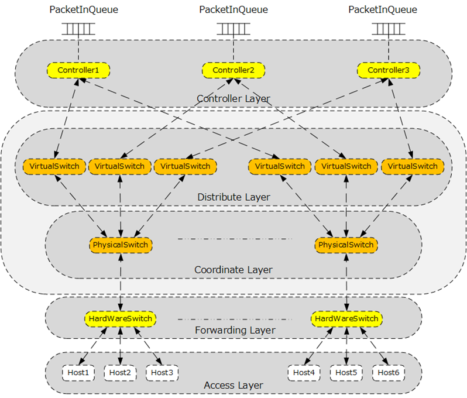
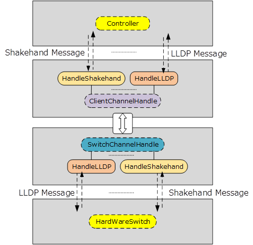
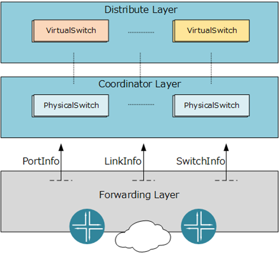
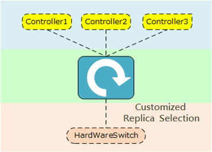

#### Dynamic SDN Control Plane Request Assignment in NFV Datacenters,
published in *IEEE Transactions on Network Science and Engineering*.

Please find the manuscript from [here](https://ieeexplore.ieee.org/document/9311437).

## Overview

>
>
>

The Coordinator is a protosystem for coordinated controller replica selection architecture in multi-controller SDN. The Coordinator is highly inspired by On.lab's OpenVirtex project.

## Features

1. Proxy for LLDP and OFHandShake.

>
>
>

2. Proxy for OFStatistics.

>
>
>

3. Customized controller replica selection scheme, southbound -> northbound (select replica for OFPacketIn), northbound -> southbound (send OFPacketOut to downstream).

>
>
>

## Content Catalog

1. coordinator_deployable: providing compiled deployable version.
2. coordinator_source: providing version of source code, can be re compiled.
